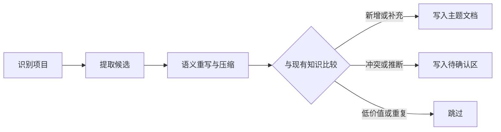

# Codex 项目知识沉淀

把对话中的有效结论转成项目资产，不保存聊天流水，不机械复述或直译原话。始终将知识写入当前项目，不建立跨项目统一知识库。

## 工作流



先确定项目边界，再提炼语义、查重和写入；任何冲突都不得覆盖正式结论。

### 1. 识别并初始化当前项目

1. 先向上查找最近的 `.codex-knowledge.json`；找到后使用其所在目录。否则执行 `git rev-parse --show-toplevel`；不是 Git 项目时，向上查找项目标志文件，最后才使用当前目录。
2. 检查项目根目录下的 `.codex-knowledge.json`。
3. 首次进入项目或配置不存在时，运行：

   ```bash
   python3 <skill-dir>/scripts/knowledge_store.py init --project-root <project-root>
   ```

4. 默认把知识写入项目内的 `docs/codex-knowledge/`。用户指定其他项目内路径时，通过 `--knowledge-dir <relative-path>` 初始化。
5. 只接受项目内相对路径。不要把知识目录配置为绝对路径、父目录或共享目录。

路径配置本身就是项目依赖记录。项目移动后，依赖仍通过相对路径解析。该文件应随项目纳入版本管理；如果团队明确不希望共享，则由用户决定加入忽略规则。

### 2. 提取候选知识

回顾本次可见的用户要求、已读项目文件、工具结果和验证结果。只提取：

- 已确认的项目决策与约束
- 已验证的解决方案与根因
- 可复用的踩坑经验
- 稳定的项目事实
- 用户明确说明的项目偏好

不要提取聊天原文、一次性进度、未验证猜测、秘密、令牌、个人敏感信息或能从代码直接轻易查到的细枝末节。详细准入规则见 [references/admission-rules.md](references/admission-rules.md)。

### 3. 语义重写与压缩

写入前先理解事实、关系、约束、因果和适用范围，再重新组织表达。禁止逐句改写、字面翻译或沿用含糊口语。

1. 使用当前项目和行业中含义最准确的术语；不要为了中文化翻译已有明确含义的专有名词。
2. 标题直接命名主题，结论先写“以后应记住什么”，删除讨论过程和铺垫。
3. 一条知识只保留一个中心结论；关键点通常不超过 5 条。
4. 框架、架构、工作流、状态流转或多组件关系优先提供 Mermaid，再用短文字解释图中不明显的约束。
5. Markdown 中的数学公式使用 LaTeX：行内公式写成 `$...$`，独立公式写在成对的 `$$` 行之间。
6. 写入前按 [references/writing-guidelines.md](references/writing-guidelines.md) 完成表达检查。

### 4. 查重并决定动作

先读取路径配置和 `INDEX.md`，再用候选关键词与稳定 ID 搜索知识目录：

```bash
python3 <skill-dir>/scripts/knowledge_store.py resolve --project-root <project-root>
rg -n "<关键词|knowledge-id>" <resolved-knowledge-dir>
```

为每条候选选择一个动作：

- `add`：没有同义条目，新增知识。
- `update`：结论一致，仅补充范围、原因、证据或细节。
- `conflict`：新旧结论矛盾、适用范围不清或证据只有推断。写入 `pending-review.md`，不要覆盖原结论。
- `skip`：重复、低价值、临时、敏感或证据不足。不写文件。

稳定 ID 使用简短的 kebab-case 语义名称，例如 `store-time-in-utc`。同一知识后续继续使用原 ID。

### 5. 形成结构化条目并写入

按 [references/entry-schema.md](references/entry-schema.md) 生成一个临时 JSON 文件，然后运行：

```bash
python3 <skill-dir>/scripts/knowledge_store.py write \
  --project-root <project-root> \
  --input <entry.json>
```

脚本负责字段校验、稳定 ID 定位、写入主题文档和重建索引。临时 JSON 不属于项目资产，写入成功后删除或留在系统临时目录。

### 6. 汇报沉淀结果

简洁说明：

- 当前项目根目录和知识目录
- 新增、更新、待确认、跳过的条目
- 跳过或待确认的关键原因

没有合格候选时，明确说明“本次没有值得沉淀的稳定知识”，不要为了产出而写入。

## 证据与覆盖规则

- `user-confirmed`：用户明确决定或确认。
- `verified`：测试、命令或可复现结果验证。
- `observed`：项目代码、配置或正式文档直接支持。
- `inferred`：基于上下文推断，只能进入待确认区。

任何冲突都不得静默覆盖。只有用户明确确认新结论，或新证据已直接验证且旧结论明显失效时，才更新已有条目，并在原因或来源中保留变更依据。

## 项目边界

- 一个项目对应一个 `.codex-knowledge.json` 和一个项目内知识目录。
- 不读取其他项目的知识来替当前项目做决定，除非用户明确要求比较。
- 不在技能目录中保存具体项目知识。
- 在 monorepo 中默认使用 Git 根目录；若用户明确把子目录视为独立项目，则以该子目录为根初始化独立配置。
- 没有项目写权限时，只输出候选条目和建议路径，不改写其他位置。

## 参考文件

- [references/admission-rules.md](references/admission-rules.md)：判断什么值得沉淀、证据强度和隐私边界。
- [references/writing-guidelines.md](references/writing-guidelines.md)：语义重写、信息压缩和 Mermaid 选择规则。
- [references/entry-schema.md](references/entry-schema.md)：写入 JSON 的字段、动作和示例。
