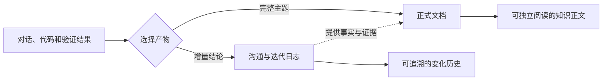

# Codex 项目知识沉淀

把项目知识分成两类产物：日志负责忠实保留结论如何演进，文档负责让没有参与讨论的人完整理解一个主题。不要把日志卡片直接拼成文章，也不要为了让文章流畅而改写历史日志。

## 双轨模型



两条链路共享项目边界和证据规则，但职责不同：

- **日志链路**：记录一个独立的决定、约束、事实、解法或踩坑经验。保持卡片结构，允许持续追加和修订。
- **文档链路**：默认围绕当前项目整体维护一份主文档。组织背景、目标、方案、机制、取舍、边界和验证，更新时重审全文结构；只有主文档已经不适合共同维护时才拆分。

## 选择链路

根据用户目标和材料成熟度决定：

- 用户要求“记一下、沉淀这次结论、保留决策记录”，或本次只产生少量独立事实：写日志。
- 用户要求“写文档、整理成文章、补全说明”，或已有材料足以补充项目整体认知：优先更新现有项目主文档。
- 一次重要设计、实现或排障同时产生增量结论和系统性认识：先写日志，再基于已确认事实更新项目主文档。
- 只有零散信息，尚不足以形成主线：只写日志；不要创建只有标题和要点的空壳文档。
- 新事实与已有结论冲突或只有推断：写入待确认区，不得进入稳定文档。
- 新主题、新功能、新任务、新阶段或新的讨论日期都不是新建文档的理由。只有满足 [references/document-writing.md](references/document-writing.md) 的拆分条件时，才能增加正式文档。

## 识别并初始化项目

1. 向上查找最近的 `.codex-knowledge.json`；未找到时使用 Git 根目录，再退回项目标志文件所在目录或当前目录。
2. 配置不存在时运行：

   ```bash
   python3 <skill-dir>/scripts/knowledge_store.py init --project-root <project-root>
   ```

3. 默认知识目录为 `docs/codex-knowledge/`：
   - `topics/`：沟通与迭代日志，为兼容已有项目保留该目录名。
   - `documents/`：完整正式文档；默认只有一份项目主文档，必要时才包含拆分文档。
   - `pending-review.md`：冲突和低置信候选。
   - `INDEX.md`：分区导航两类产物。
4. 只使用项目内相对路径。不要把知识写入其他项目或技能目录。

## 日志链路

1. 提取已确认决定、已验证解法、稳定约束、隐蔽事实、可复用踩坑和项目偏好。
2. 按 [references/admission-rules.md](references/admission-rules.md) 排除临时进度、聊天原文、秘密、无证据猜测和显而易见的代码细节。
3. 按 [references/writing-guidelines.md](references/writing-guidelines.md) 将每张卡片压缩成一个中心结论。
4. 搜索稳定 ID 和同义结论，选择 `add`、`update`、`conflict` 或 `skip`。
5. 按 [references/entry-schema.md](references/entry-schema.md) 生成 JSON，执行：

   ```bash
   python3 <skill-dir>/scripts/knowledge_store.py write-log \
     --project-root <project-root> \
     --input <log-entry.json>
   ```

`write` 是兼容旧调用的别名。日志中可以保留记录信息和来源，因为其目标是追踪变化，而不是连续阅读。

## 文档链路

1. 先扫描 `documents/` 和 `INDEX.md`。已有项目主文档时必须先选择 `update`，不得仅因本次内容属于新主题而使用新 ID。
2. 明确本次更新要解决的问题、目标读者、范围和非目标；用户指定了技术类、科普类、研究类等写作风格时直接采用，未指定时根据文档用途和读者选择。风格会约束术语密度、解释深度和示例方式，但不能替代正文主题。
3. 读取主文档全文及相关日志、代码、配置、正式资料和验证结果，建立事实清单并排除冲突和推断。
4. 按 [references/document-writing.md](references/document-writing.md) 规划大纲，从整篇文章的角度重组受影响章节，不在末尾机械追加，也不逐卡片翻译。章节名直接描述所讲内容，不把“建议”“comment”“影响与验收”等讨论或检查用语机械写入正文。
5. 项目没有正式文档时创建一份主文档。项目已有正式文档时，只有通过拆分检查才能 `add`；拆分后仍需同步更新主文档的概览、边界和导航。
6. 更新文档时同步检查上下游描述、图示、示例和结论。
7. 按 [references/document-schema.md](references/document-schema.md) 生成 JSON，执行：

   ```bash
   python3 <skill-dir>/scripts/knowledge_store.py write-document \
     --project-root <project-root> \
     --input <document.json>
   ```

8. 将信息不全但仍有价值的文章标为 `draft`。只有正文完整、事实已确认且不存在占位内容时，才能标为 `stable`。

## 共同证据规则

- `user-confirmed`：用户明确决定或确认。
- `verified`：测试、构建、运行结果或可复现步骤直接证明。
- `observed`：项目代码、配置或正式资料直接支持。
- `inferred`：基于上下文推断，只能进入待确认区。

文档可以综合多张日志卡片与其他项目材料，但不得提高证据强度。冲突必须先解决；无法解决时在草稿中明确边界，不得写成确定事实。

## 汇报结果

说明项目根目录和知识目录，并分别列出：

- 日志：新增、更新、待确认和跳过的卡片。
- 文档：更新的项目主文档及覆盖范围；如确有拆分，额外说明拆分文档、来源主文档和拆分理由。

没有合格内容时明确说明没有写入，不要为了产出制造日志或空壳文档。

## 参考文件

- [references/admission-rules.md](references/admission-rules.md)：两条链路的内容准入、证据和隐私边界。
- [references/writing-guidelines.md](references/writing-guidelines.md)：日志卡片的语义重写、压缩、图示与公式规则。
- [references/entry-schema.md](references/entry-schema.md)：日志卡片 JSON 字段和示例。
- [references/document-writing.md](references/document-writing.md)：正式文档的类型、大纲、成文方法和完整性检查。
- [references/document-schema.md](references/document-schema.md)：正式文档 JSON 字段和示例。
