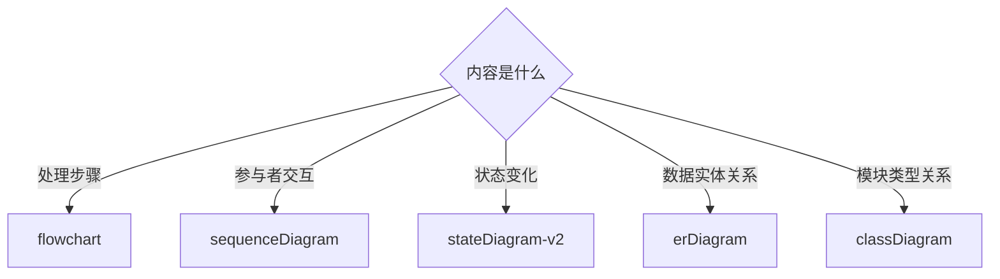

# 知识表达规范

## 语义重写

先回答四个问题，再起标题和写结论：

1. 实际确认了什么事实、选择或约束？
2. 它影响哪个对象和范围？
3. 为什么未来任务需要知道它？
4. 项目中哪个术语能最准确地指代它？

禁止把用户原话逐句换词、逐字翻译或直接粘贴。保留语义与证据，不保留聊天句式。

### 术语选择

- 优先使用项目代码、正式文档和团队已经采用的名称。
- 行业专有名词已有稳定含义时可以保留英文，例如 `Redis`、`RPC`、`fallback`；仅在中文表达更准确时翻译。
- 根据实际机制选择词语。例如，失败后切换备用服务应写“故障转移”，能力不可用时返回简化结果应写“降级”，不能统一直译为“回退”。
- 不确定术语时先搜索项目，再决定名称；仍不确定则写入待确认区。

### 改写示例

原始交流：

> memory 这块不要放到一个公共地方，每个 repo 自己存一下路径。

不合格：

> 内存不要放公共位置，每个仓库自己存路径。

合格：

> 项目知识采用仓库级隔离；每个项目通过相对路径配置定位自己的知识目录。

前者把 `memory` 机械翻译成“内存”，改变了含义；后者准确表达了知识存储边界和路径机制。

## 信息压缩

按以下优先级保留内容：

1. 关键结论或强约束
2. 适用范围和边界
3. 执行所需的关键点
4. 决策原因或验证依据
5. 来源和记录信息

默认限制：

- 标题只命名一个主题。
- 结论使用 1–2 句，开头直接给决定或事实。
- 关键点不超过 5 条，每条只表达一个信息。
- 原因只解释影响结论成立的核心因果。
- 删除背景铺垫、尝试过程、失败日志和已经被结论涵盖的重复内容。
- 来源只保留能独立增强可信度的证据，不用不同措辞重复同一次确认。

## Mermaid 选择

只有图能显著降低理解成本时才使用 Mermaid。框架、架构、流程、状态流转以及三个以上组件的关系通常适合画图。



图文分工：

- Mermaid 表达节点、方向、分支和关系。
- 文字只补充图中不明显的结论、边界、异常和原因。
- 不要用一张图重复全文，也不要用大段文字逐节点复述图。
- 节点名称使用准确业务词，不使用“处理”“模块 A”“相关逻辑”等空名称。
- 节点文字包含括号、问号等标点时使用引号，例如 `A{"请求成功?"}`。
- 简单单点事实、单条约束或两项比较无需强行画图。

框架或流程条目默认提供 `diagram`。确实无法用图提升理解时，填写 `diagram_omission_reason`，说明为什么文字更清楚。

## LaTeX 公式

Markdown 文档中的数学公式统一使用支持渲染的 LaTeX 定界符。

行内公式使用单个美元符号，公式与定界符之间不留空格：

```markdown
PPO 使用比率 $r_t=\frac{\pi_\theta(a_t\mid s_t)}{\pi_{\mathrm{old}}(a_t\mid s_t)}$ 衡量策略更新幅度。
```

独立公式使用成对的 `$$`，开始和结束定界符各占一行：

```markdown
$$
L_{\mathrm{PPO}}
=-\mathbb{E}_t\left[
\min\left(r_tA_t,\operatorname{clip}(r_t,1-\epsilon,1+\epsilon)A_t\right)
\right]
$$
```

必须遵守：

- 不使用 `\(...\)` 或 `\[...\]`；部分 Markdown 渲染器不会识别它们。
- 不把公式放入普通代码块、行内代码或 Mermaid 节点中。
- 多行推导使用一个 `$$` 块，并在块内使用 `aligned`、`cases` 等 LaTeX 环境。
- 普通美元金额中的 `$` 写成 `\$`，避免被识别为公式定界符。
- JSON 输入中的 LaTeX 反斜杠需要转义，例如 `\\frac`；写入 Markdown 后会还原为 `\frac`。
- 公式只表达数学关系；变量含义、前提和结论仍使用简短文字说明。

## 写入前检查

- 如果看不到原对话，条目是否仍然准确、完整？
- 是否存在机械直译、含糊代词或项目中不存在的自造术语？
- 前两屏是否已经出现最关键的结论和图示？
- 删除任一段后，是否不影响未来决策？如果不影响，就删除。
- 框架或流程是否选择了合适的 Mermaid 类型？
- 行内公式是否使用 `$...$`，独立公式是否使用单独成行的 `$$`？
