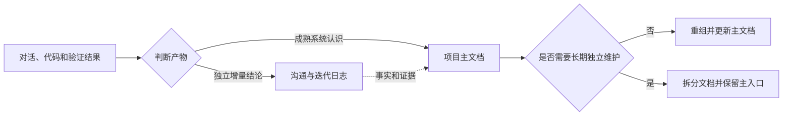

<!-- codex-document:project-knowledge-capture -->
<!-- codex-document-meta:{"id":"project-knowledge-capture","title":"项目知识双轨沉淀机制","type":"architecture","status":"stable","writing_style":"technical","summary":"说明项目如何用迭代日志保留结论演进，并以面向读者的写作方式持续维护项目主文档。","audience":["项目开发者","维护项目知识的 Codex Agent"],"scope":"项目内可复用知识的采集、记录、成文、更新、拆分和导航","source_log_ids":["keep-knowledge-project-local","write-semantic-concise-knowledge","render-math-with-latex-delimiters","separate-logs-and-documents","maintain-one-project-document","write-reader-oriented-formal-documents"],"created_at":"2026-08-24","updated_at":"2026-08-28","style_notes":"面向项目开发者，以机制、输入约束和写入行为为主线，示例只用于解释实际规则。"} -->
# 项目知识双轨沉淀机制

> 说明项目如何用迭代日志保留结论演进，并以面向读者的写作方式持续维护项目主文档。

## 需要解决的问题

项目交互会持续产生两类知识。一类是某次工作中刚刚确认的决定、约束和验证结果，它需要保留发生时间、证据与后续变化；另一类是围绕项目形成的稳定认识，它需要让没有参与讨论的人也能理解背景、方案和使用方法。

如果所有内容都使用卡片展示，正式知识会变成条目清单；如果每出现一个新主题就创建一篇文章，项目事实又会散落、重复并逐渐不一致。项目因此采用日志与文档双轨沉淀：日志保存演进过程，正式文档维护当前有效的系统认识。

## 双轨结构

两条链路共享同一个项目范围和证据体系。项目根目录的 `.codex-knowledge.json` 以相对路径定位知识目录，使知识能够随仓库移动和版本管理。`topics/` 保存卡片日志，`documents/` 默认保存一份项目主文档，`pending-review.md` 隔离冲突或证据不足的信息，`INDEX.md` 提供统一入口。

## 沟通与迭代日志

日志以一个中心结论为最小单位，适合记录已确认的技术选择、强约束、稳定事实、验证有效的方案、可复用踩坑和项目偏好。每张卡片具有稳定 ID，并保留结论、关键点、依据、适用范围、证据类型、时间和来源。

日志的价值在于可追溯，而不是连续阅读。新增信息与已有结论一致时更新原 ID；发生矛盾、范围不清或只能推断时，先进入待确认区，不静默覆盖旧结论。临时进度、完整对话原文、秘密、偶发现象和容易从代码直接获得的细节不进入日志。

## 项目主文档

第一份正式文档作为项目主文档，围绕项目整体持续维护。创建前先确定目标读者、阅读目标、范围和非目标，再从日志、代码、配置、测试结果和正式资料中建立事实清单。文章按照理解顺序组织，先让读者知道要解决什么，再解释整体方案和关键机制，最后补足实际使用需要的条件与例外。

新功能、新任务、新阶段和新主题都优先进入这份主文档。更新时阅读全文并重组相关章节，同步修正概览、关系、图示、示例和已发生变化的结论。文档 ID 与路径保持稳定，使读者始终可以从同一个入口理解项目。日志卡片只为正文提供事实，不直接变成文章章节。

## 面向读者的写作方式

正式文档呈现整理后的主题知识，不展示形成正文前的对话、审阅标记和写作动作。章节名称直接描述业务对象、技术机制或读者任务，不能把内部检查项当作通用目录。例如，数据清洗应根据实际内容说明字段标准化、缺失值处理、异常值识别和重复数据合并，而不是使用与具体方法无关的笼统标题。

每次写作可以指定表达风格。技术类面向工程师，重点说明原理、数据结构、接口、流程和异常处理；科普类先解释概念与因果，再逐步引入术语；研究类简述背景与结论，详细展开创新点、方法和实验依据；业务类围绕场景、规则和决策信息组织；操作类明确前提、步骤、判断条件和结果。自定义风格可以进一步约束口吻、详略、术语密度和示例形式。未明确指定时，系统根据文档类型和目标读者选择默认风格。

风格只改变表达方式，不改变事实强度。无论选择哪种风格，都不能虚构例子、隐藏会改变结论的条件，也不能为了套用模板而生成与主题无关的章节。

## 文档拆分方式

拆分是例外。只有内容形成稳定且可独立命名的范围，需要长期独立维护、阅读或交付，并且主文档经过删重、重组和改善导航后仍难以维护时，才创建拆分文档。单纯出现新模块、新版本、里程碑或较长正文并不构成理由。

确需拆分时，新文档记录来源主文档和具体原因；主文档保留必要概览和入口。两边不复制维护同一组核心事实，读者仍能从主文档理解项目全貌。

## 写入与更新

一次任务只产生零散事实时，仅写日志。材料已经能补充系统认识，或需要形成完整说明时，先扫描 `INDEX.md` 与 `documents/`；只要已有主文档，就整体更新原文。重要设计、实现和排障同时产生两类价值时，先固化日志，再以确认后的事实更新主文档。

写入脚本校验文档类型、写作风格、正文完整性和拆分关系。旧输入未提供 `writing_style` 时会按文档类型选择默认值；显式选择 `custom` 时必须同时提供 `style_notes`。脚本还会拒绝明显的审阅痕迹和机械检查标题，避免它们进入正式正文。

## 证据与使用范围

两条链路都只采用用户确认、执行验证或项目材料直接支持的事实。推断不会因为写进文章而自动变成结论。信息尚不完整但已有持续价值时，文档标记为草稿；只有正文完整、关键事实明确且没有占位内容时，才标记为稳定。

这套机制服务于当前项目中未来仍会复用的知识，不建设跨项目集中知识库，也不替代代码、接口定义、测试、版本历史或专门的运维系统。能够由自动化稳定保证的事实，应优先留在对应系统中；知识文档补充这些系统难以表达的原因、关系和使用方法。

## 参考依据

- 用户确认，2026-08-20
- 用户确认双轨沉淀方式，2026-08-24
- 用户确认单项目主文档维护方式，2026-08-24
- 用户确认面向读者的正式文档写作方式，2026-08-28
- codex-knowledge-capture/SKILL.md
- codex-knowledge-capture/references/document-writing.md
- codex-knowledge-capture/references/document-schema.md
- codex-knowledge-capture/scripts/knowledge_store.py
<!-- /codex-document:project-knowledge-capture -->
